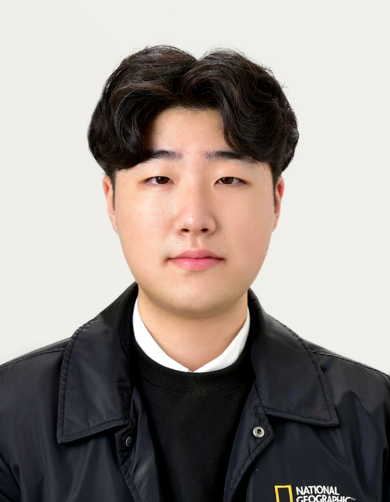

# Resume

💡 인적사항
---

* 이름   
**주민재**
* 생년월일   
**2002.08.12**
* 소속   
**한림대학교 정보과학대학 소프트웨어학부**
* E-mail   
minjae0812@naver.com
* Github   
https://github.com/Juminjae

📋 동아리 활동
---
* **2021 씨애랑 학술동아리 라떼팀**
   * Java 기초교육 참여
   * 라떼팀 팀교육 참여
* **2022 씨애랑 학술동아리 라떼팀**
   * 라떼팀 팀교육 참여(안드로이드)
* **2022 한빛사진회 중앙동아리**

🏆 자격증
---
* 그래픽기술자격 GTQ 2급
* 리눅스마스터 2급 
* 웹디자인기능사 필기/실기 응시완료 
  
💻 프로젝트 경험
---
* **2022 Google GDSC Solution Challenge 참여**
  * 📱 안드로이드   
    * HealthChecklist
        * 개요 : 노인분들의 건강관리를 돕는 어플을 제작, 모든 연령층을 위한 건강한 삶 보장과 복지 증진
        * 제작인원 : 2명
        * Github : https://github.com/Juminjae/2022-Solution-Challenge-HealthChecklist
  
🛠️ 사용가능 언어
---
* C
* Java
* Javascript
* HTML, CSS
* Python
* React.js

📚 2021 수강과목(전공)
---
|번호|과목명|학점|
|:---:|:---:|:---:|
|1|이산구조론|3|
|2|자바프로그래밍I|3|
|3|소프트웨어개론|3|
|4|컴퓨팅사고와 문제해결|2|
  
📚 2022 수강중인 과목(전공)
---
|번호|과목명|학점|
|:---:|:---:|:---:|
|1|자바프로그래밍II|3|
|2|소프트웨어세미나I|1|

📅 2022 활동 목표
---
1. 깃허브 1일 1커밋
2. 공모전 및 대회 참가
3. 안드로이드 프로젝트 진행
4. 웹 디자인 기능사 자격증 취득

✏️ 성적
---
|1-1|1-2|
|---|---|
|4.12|학기 중|
 
## 🚩 목표
학교에서 할 수 있는 모든 것들을 접해보면서 다방면으로 경험하고 그 안에서 발생하는 문제나 불편했던 것들을 개선해 나가는 개발자로 성장하고 싶고, 자격증 취득, 해커톤 및 공모전 등을 참여하면서 개발자 네트워크도 넓혀나가는 것을 목표로 하고 있으며, 좋은 아이디어가 있다면 대학생활 중에 창업을 해서 소프트웨어로 세상의 변화를 줄 수 있는 기업가가 되는 것을 목표로 하고 있습니다.
